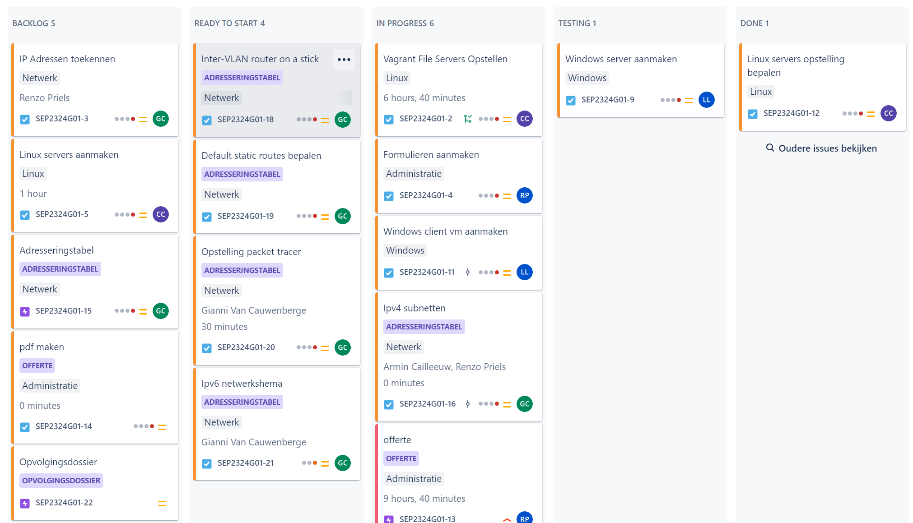
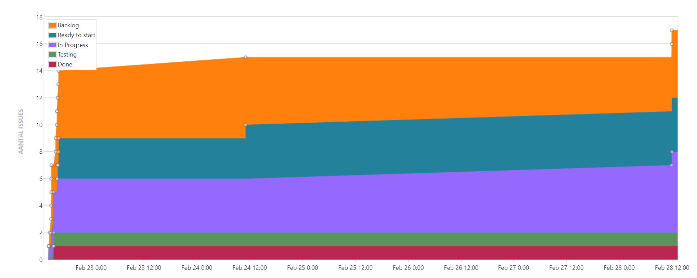

# Opvolgingsrapport 1

## Algemeen

- Groep: G01
- Periode: 22/2/2024 tot 28/2/2024
- Datum voortgangsgesprek: 29/2/2024

| Student | Afw. | Opmerking |
| :------ | :--: | :-------- |
| Armin   |      |           |
| Charan  |      |           |
| Gianni  |      |           |
| Louis   |      |           |
| Renzo   |      |           |

## Wat heb je deze periode gerealiseerd?

### Algemeen

- Adresseringstabel voor ipv4 afgewerkt
- Opstelling PT bepaald
- Formulieren aangemaakt
- Jira in orde gezet
- Opstelling Servers bepaald
- Vagrant hosts file aangemaakt

#### KanBan

<!-- Voeg hier een screenshot toe van de huidige toestand van het kanban bord. -->

#### Tijdsregistratie

<!-- Voeg hier een screenshot toe van het teamoverzicht van de tijdregistratie, met totaal per student en team -->

#### Cumulatief flow diagram

<!-- Voeg hier een screenshot toe van het cumulatief flow diagram voor de periode van het rapport. -->

<!-- Voeg hier een screenshot toe van het cumulatief flow diagram voor de volledige periode van het project. -->

### Armin

<!-- Voeg hier een overzicht toe van gerealiseerde taken inclusief links naar relevante commits/documenten. -->

- Adresseringstabel voor ipv4 afgewerkt
- Informatie opzoeken tftp-server
- opstart offerte

<!-- Voeg hier een screenshot van het individueel tijdregistratierapport, met overzicht van elke taak en bijhorende uren. -->

### Charan

<!-- Voeg hier een overzicht toe van gerealiseerde taken inclusief links naar relevante commits/documenten. -->

- Opstelling Linux Servers gefinaliseerd
- Vagrant-Hosts file aangemaakt en ingevuld [Bestanden Toegevoegd,](https://github.com/HoGentTIN/sep2324-gent-g01/commit/8839784ceff0c5aba72e7877ce504267771cfab0) [Bestanden Aangepast](https://github.com/HoGentTIN/sep2324-gent-g01/commit/1c968395cda74fad5d93913f03c8cb553c028f5c#diff-abd7ce0014e21fed6fdbf18f10e639072c201317276400ce08cedd483b9adb0c)

<!-- Voeg hier een screenshot van het individueel tijdregistratierapport, met overzicht van elke taak en bijhorende uren. -->

### Gianni

- Adresseringstabel voor ipv4 afgewerkt
- KanBan bord uitgewerkt
- start configuratie ipv4

<!-- Voeg hier een screenshot van het individueel tijdregistratierapport, met overzicht van elke taak en bijhorende uren. -->

### Louis

<!-- Voeg hier een overzicht toe van gerealiseerde taken inclusief links naar relevante commits/documenten. -->

- Windows Server herinstalleert (eerst geen CLI aangemaakt maar een server met GUI)
- Domain Controller gemaakt van Server
- Windows Client klaargezet + RSAT Tools geïnstalleerd

<!-- Voeg hier een screenshot van het individueel tijdregistratierapport, met overzicht van elke taak en bijhorende uren. -->

### Renzo

<!-- Voeg hier een overzicht toe van gerealiseerde taken inclusief links naar relevante commits/documenten. -->

- Helpen nadenken bij het opstellen van adresseringstabel
- Formulieren klaar gezet voor gebruik tijdens project
- Begonnen met opzoeken van informatie voor offerte

<!-- Voeg hier een screenshot van het individueel tijdregistratierapport, met overzicht van elke taak en bijhorende uren. -->

## Wat plan je volgende periode te doen?

### Algemeen

<!-- Voeg hier de doelstellingen toe voor volgende periode. -->

- Afgewerkte offerte
- Toestellen in PT configureren
- Vagrant afwerken en werkende krijgen
- Scripts afwerken

### Armin

<!-- Voeg hier de individuele doelstellingen toe voor volgende periode. -->

- netwerkschema opstellen
  - uitdelen ip-adressen
- configuratie van switch en router
- afwerken offerte

### Charan

<!-- Voeg hier de individuele doelstellingen toe voor volgende periode. -->

- Vagrant afwerken en werkende krijgen
- Scripts Linux Servers afwerken(hopelijk werkende krijgen)

### Gianni

- De configuratie af te werken van ipv4
  - Dit houdt in de nodige Vlan's aanmaken
  - Elk apparaat een ip geven
  - De juiste apparaten elkaar kunnen pingen

### Louis

<!-- Voeg hier de individuele doelstellingen toe voor volgende periode. -->

- Windows Server en Client verbinden met RSAT
- DNS Server
- Group Policy's instellen
- Gebruikers en gebruikersgroepen aanmaken

### Renzo

<!-- Voeg hier de individuele doelstellingen toe voor volgende periode. -->

- Onderzoek doen naar toestellen en benodigdheden voor de offerte en deze dan opstellen
- Verder het netwerk opbouwen

## Retrospectieve

### Wat doen jullie goed?

<!-- Voeg hier zaken toe die jullie goed doen naar het proces toe. -->

- ...
- ...

### Waar hebben jullie nog problemen mee?

<!-- Voeg hier zaken toe die volgens jullie beter kunnen naar het proces toe. -->

- ...
- ...

### Feedback

#### Groep

#### Armin

#### Charan

#### Gianni

#### Louis

#### Renzo
