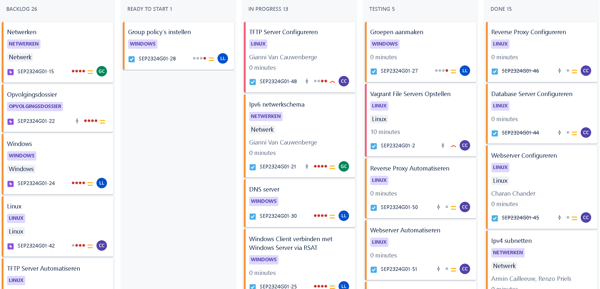
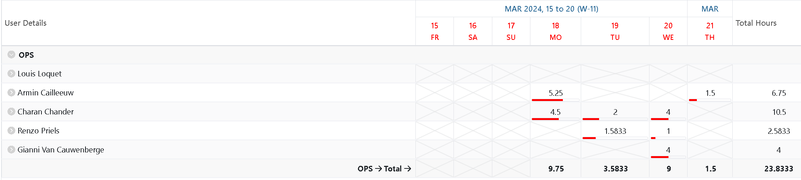
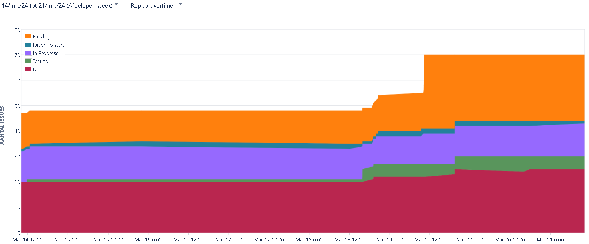
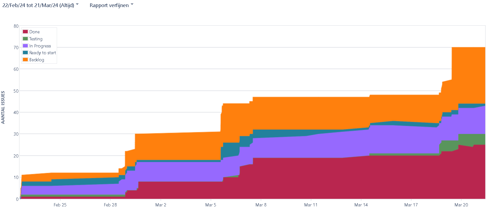
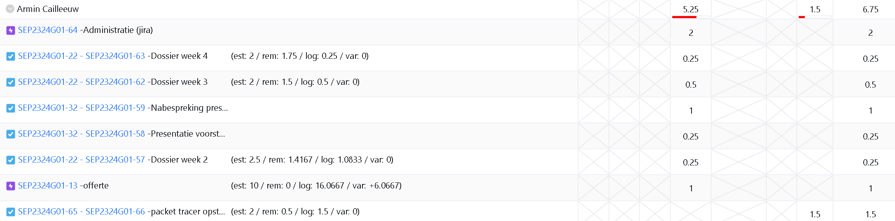

# Opvolgingsrapport 4

## Algemeen

- Groep: G01
- Periode: 14/3/2024 tot 20/3/2024
- Datum voortgangsgesprek: 21/3/2024

| Student | Afw. | Opmerking |
| :------ | :--: | :-------- |
| Armin   |      |           |
| Charan  |      |           |
| Gianni  |      |           |
| Louis   |      |           |
| Renzo   |      |           |

## Wat heb je deze periode gerealiseerd?

### Algemeen

- Testplan opgesteld voor basisconfiguratie van PT (ipv4)

#### KanBan

#### Tijdsregistratie

<!-- Voeg hier een screenshot toe van het teamoverzicht van de tijdregistratie, met totaal per student en team -->

#### Cumulatief flow diagram (voor periode rapport)

<!-- Voeg hier een screenshot toe van het cumulatief flow diagram voor de periode van het rapport. -->

#### Cumulatief flow diagram (voor volledige periode)

<!-- Voeg hier een screenshot toe van het cumulatief flow diagram voor de volledige periode van het project. -->

### Armin

<!-- Voeg hier een overzicht toe van gerealiseerde taken inclusief links naar relevante commits/documenten. -->

- Testplan opgesteld voor basisconfiguratie van PT (ipv4)
- Dossier opgesteld

<!-- Voeg hier een screenshot van het individueel tijdregistratierapport, met overzicht van elke taak en bijhorende uren. -->

### Charan

<!-- Voeg hier een overzicht toe van gerealiseerde taken inclusief links naar relevante commits/documenten. -->

- ...

<!-- Voeg hier een screenshot van het individueel tijdregistratierapport, met overzicht van elke taak en bijhorende uren. -->

### Gianni

<!-- Voeg hier een overzicht toe van gerealiseerde taken inclusief links naar relevante commits/documenten. -->

- ...

<!-- Voeg hier een screenshot van het individueel tijdregistratierapport, met overzicht van elke taak en bijhorende uren. -->

### Louis

<!-- Voeg hier een overzicht toe van gerealiseerde taken inclusief links naar relevante commits/documenten. -->

- ...

<!-- Voeg hier een screenshot van het individueel tijdregistratierapport, met overzicht van elke taak en bijhorende uren. -->

### Renzo

<!-- Voeg hier een overzicht toe van gerealiseerde taken inclusief links naar relevante commits/documenten. -->

- ...

<!-- Voeg hier een screenshot van het individueel tijdregistratierapport, met overzicht van elke taak en bijhorende uren. -->

## Wat plan je volgende periode te doen?

### Algemeen

<!-- Voeg hier de doelstellingen toe voor volgende periode. -->

- ...

### Armin

<!-- Voeg hier de individuele doelstellingen toe voor volgende periode. -->

- ...

### Charan

<!-- Voeg hier de individuele doelstellingen toe voor volgende periode. -->

- ...

### Gianni

<!-- Voeg hier de individuele doelstellingen toe voor volgende periode. -->

- ...

### Louis

<!-- Voeg hier de individuele doelstellingen toe voor volgende periode. -->

- ...

### Renzo

<!-- Voeg hier de individuele doelstellingen toe voor volgende periode. -->

- ...

## Retrospectieve

### Wat doen jullie goed?

<!-- Voeg hier zaken toe die jullie goed doen naar het proces toe. -->

- ...
- ...

### Waar hebben jullie nog problemen mee?

<!-- Voeg hier zaken toe die volgens jullie beter kunnen naar het proces toe. -->

- ...
- ...

### Feedback

#### Groep

#### Armin

#### Charan

#### Gianni

#### Louis

#### Renzo
